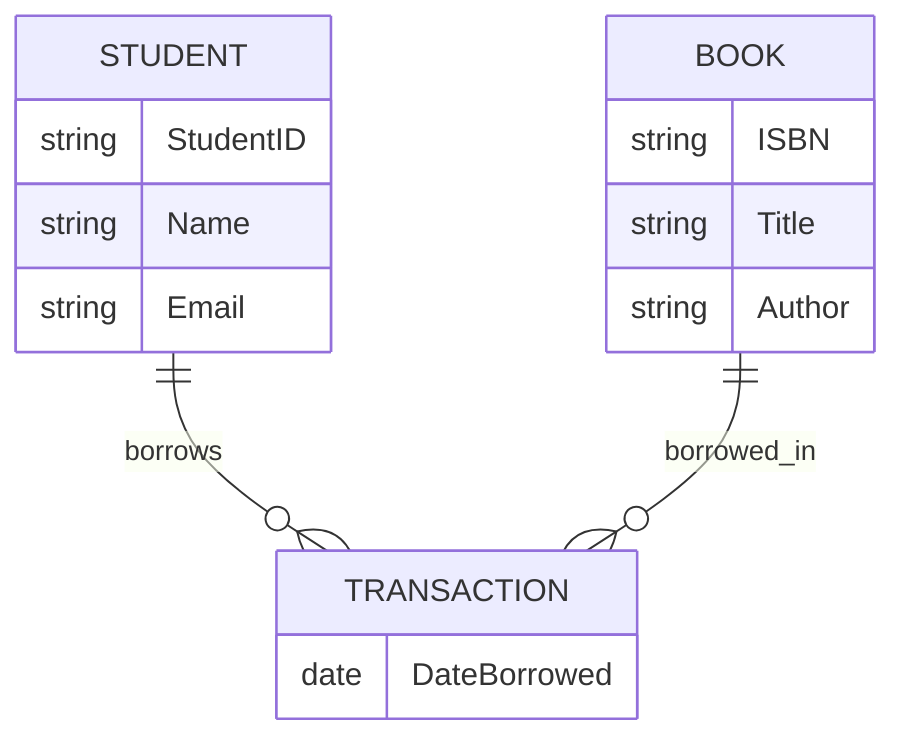
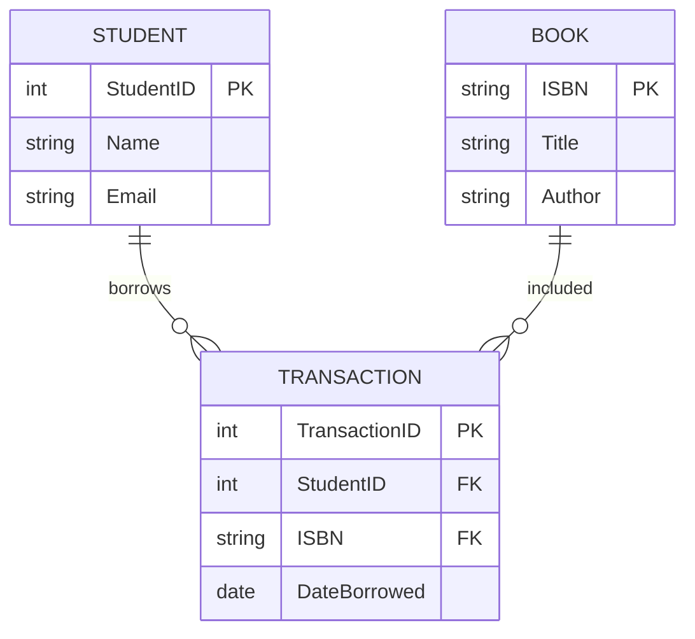
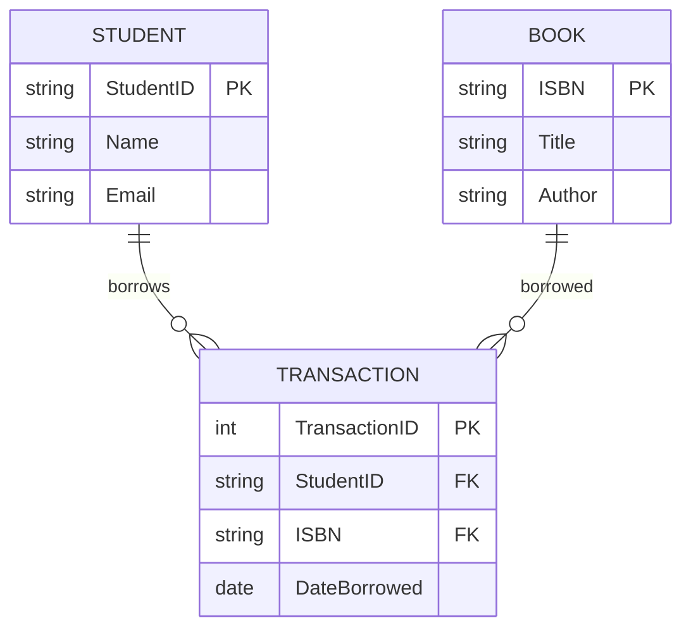

## Draw Architecture of this database

### 01. Practice 

* **Practice 1**: Designing a "University Library" System
* **Scenario**: You have been hired to design a database for a university library.
  * `Students` have a Name, a Student ID, and an Email.
  * `Books` have a Title, an ISBN (unique code), and an Author.
  * `Transaction`: Students borrow Books. We need to track the "Date Borrowed" for each transaction.

#### 1. Conceptual Design

Entities
- Student
- Book
- Transaction (Borrow)

Relationships
- A Student borrows many Books
- A Book can be borrowed many times
- Each borrow has Date Borrowed

#### 2. Logical Design

Tables

**STUDENT**
- StudentID (PK)
- Name
- Email

**BOOK**
- ISBN (PK)
- Title
- Author
- TRANSACTION

**TransactionID**
- (PK) (or composite key)
- StudentID (FK → STUDENT)
- ISBN (FK → BOOK)
- DateBorrowed

#### 3. Physical Design (Real Database Implementation – SQL)

