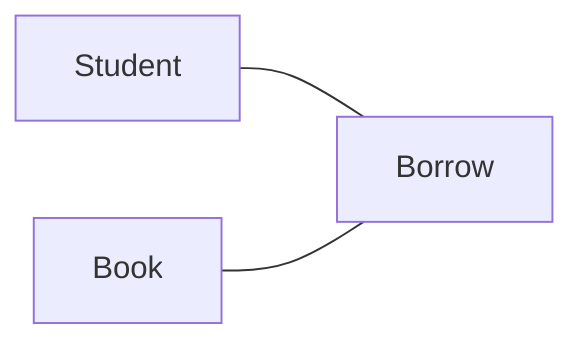
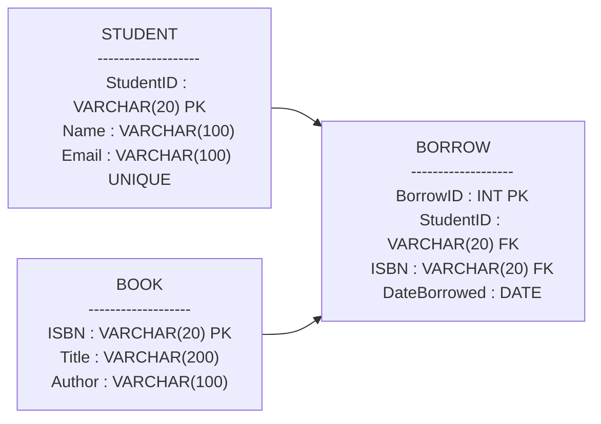
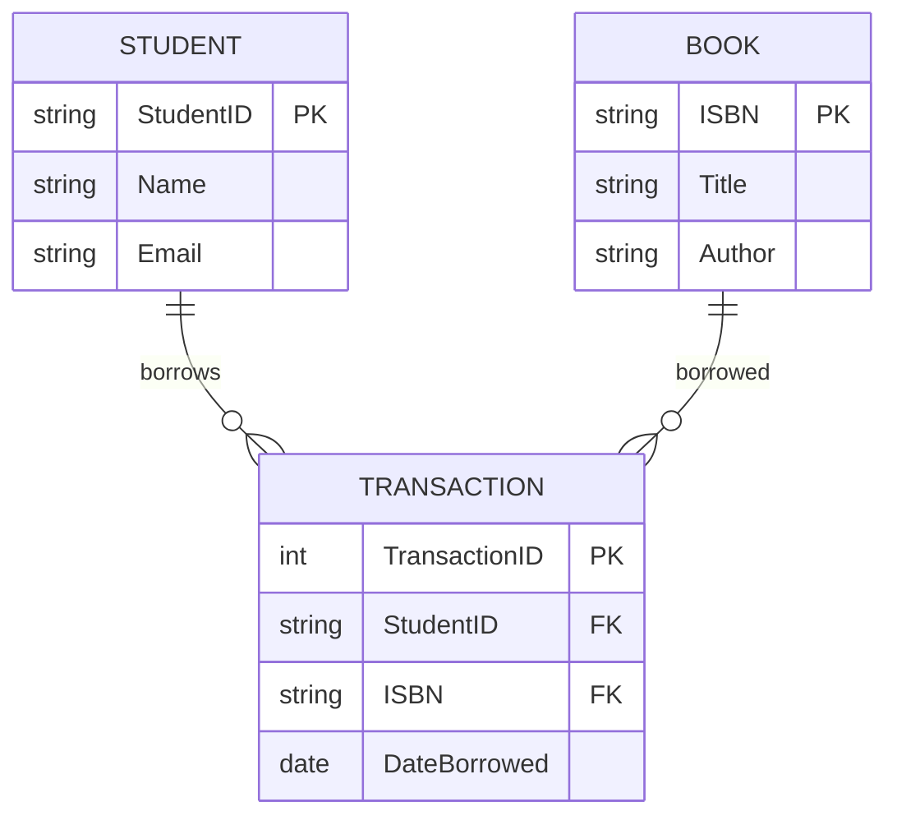

## Draw Architecture of this database

### 01. Practice 

* **Practice 1**: Designing a "University Library" System
* **Scenario**: You have been hired to design a database for a university library.
  * `Students` have a Name, a Student ID, and an Email.
  * `Books` have a Title, an ISBN (unique code), and an Author.
  * `Transaction`: Students borrow Books. We need to track the "Date Borrowed" for each transaction.


#### 1. Conceptual Design

Entities
- Student
- Book
- Transaction (Borrow)

Relationships
- A Student borrows many Books
- A Book can be borrowed many times
- Each borrow has Date Borrowed



#### 2. Logical Design

Tables

**STUDENT**
- StudentID (PK)
- Name
- Email

**BOOK**
- ISBN (PK)
- Title
- Author
- TRANSACTION

**TransactionID**
- (PK) (or composite key)
- StudentID (FK → STUDENT)
- ISBN (FK → BOOK)
- DateBorrowed




#### 3. Physical Design (Real Database Implementation – SQL)


Now we define:
- Data types
- Constraints
- Real SQL tables

**SQL Schema**
```sql
CREATE TABLE Student (
    StudentID VARCHAR(20) PRIMARY KEY,
    Name VARCHAR(100) NOT NULL,
    Email VARCHAR(100) UNIQUE NOT NULL
);

CREATE TABLE Book (
    ISBN VARCHAR(20) PRIMARY KEY,
    Title VARCHAR(200) NOT NULL,
    Author VARCHAR(100) NOT NULL
);

CREATE TABLE Transaction (
    TransactionID INT AUTO_INCREMENT PRIMARY KEY,
    StudentID VARCHAR(20),
    ISBN VARCHAR(20),
    DateBorrowed DATE NOT NULL,

    FOREIGN KEY (StudentID) REFERENCES Student(StudentID),
    FOREIGN KEY (ISBN) REFERENCES Book(ISBN)
);
```
