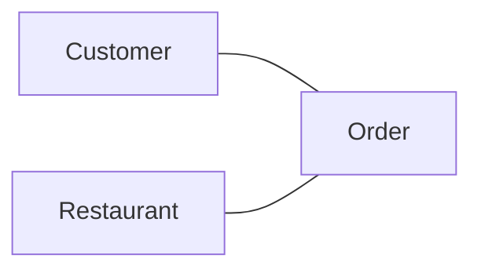
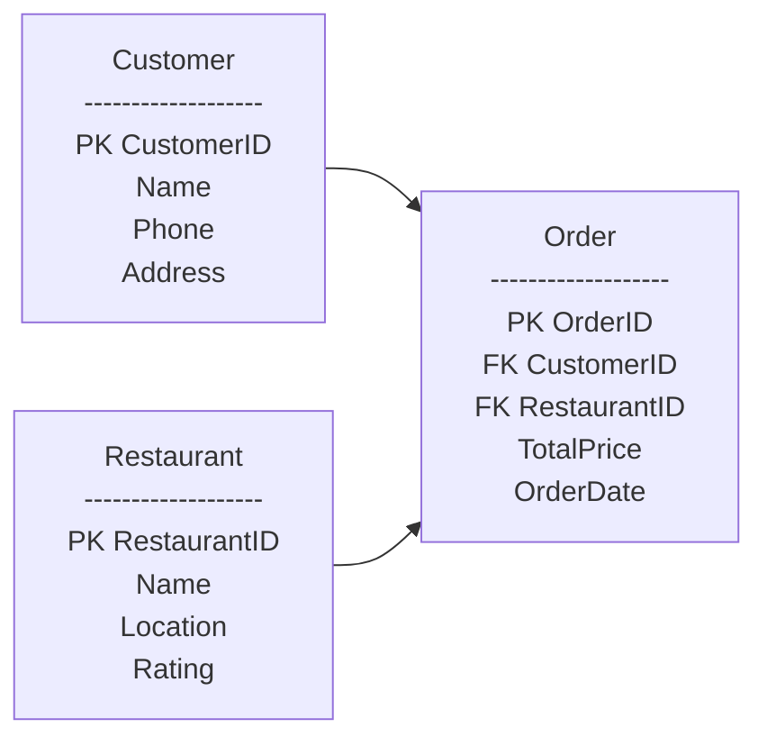
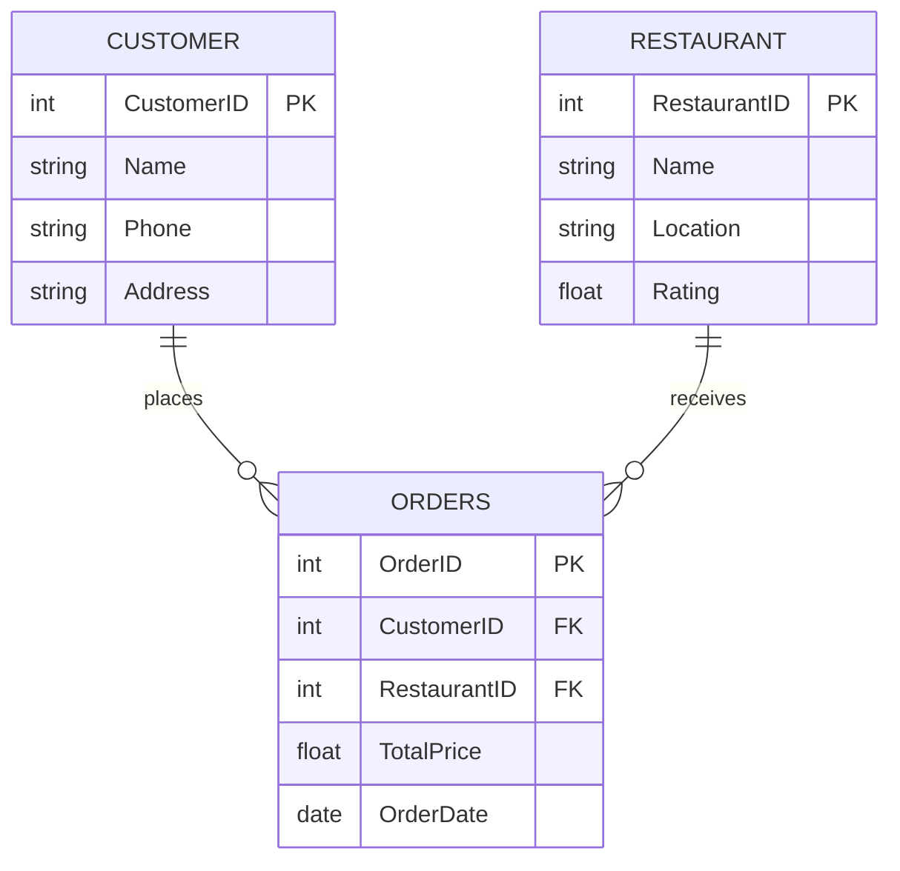

## Online Food Ordering System — Database Design

### 1. Conceptual Model Design (Business View)

Main Entities
- Customer
- Restaurant
- Order

Relationships
- Customer places Order
- Restaurant receives Order
- Order has Total Price and Order Date

### 2. Conceptual Model Design (Business View)

**Tables Structure**

Customer
- PK CustomerID
- Name
- Phone

Address
- Restaurant
- PK RestaurantID
- Name

Location
- Rating
- Order
- PK OrderID
- FK CustomerID → Customer
- FK RestaurantID → Restaurant
- TotalPrice
- OrderDate

### 3. Physical Model Design (Real Database — Data Types)

Now we add:
- Data types
- Constraints
- Real structure like DB implementation

