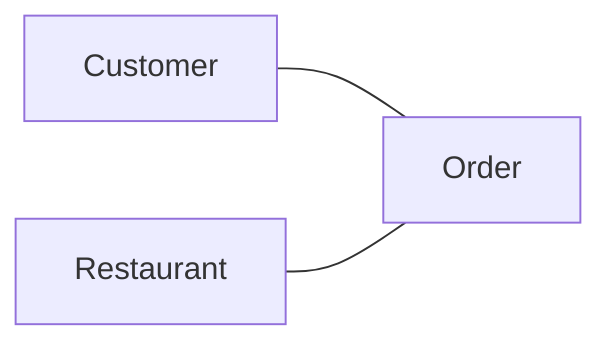
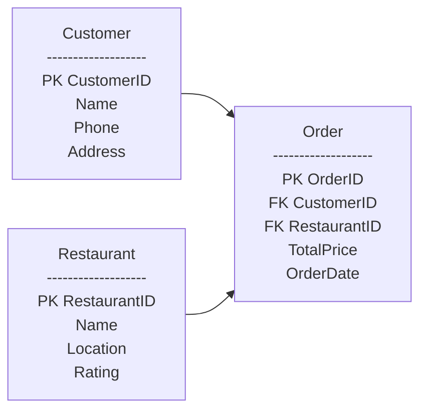
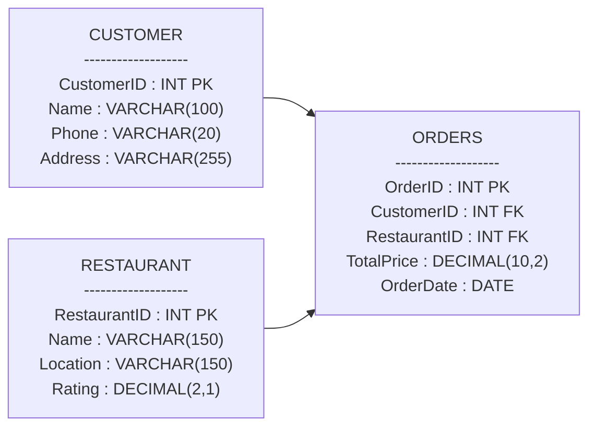

## Online Food Ordering System — Database Design

### 1. Conceptual Model Design (Business View)

Main Entities
- Customer
- Restaurant
- Order

Relationships
- Customer places Order
- Restaurant receives Order
- Order has Total Price and Order Date


### 2. Conceptual Model Design (Business View)

**Tables Structure**

Customer
- PK CustomerID
- Name
- Phone

Address
- Restaurant
- PK RestaurantID
- Name

Location
- Rating
- Order
- PK OrderID
- FK CustomerID → Customer
- FK RestaurantID → Restaurant
- TotalPrice
- OrderDate




### 3. Physical Model Design (Real Database — Data Types)

Now we add:
- Data types
- Constraints
- Real structure like DB implementation

**SQL Tables**
```sql
CREATE TABLE Customer (
    CustomerID INT AUTO_INCREMENT PRIMARY KEY,
    Name VARCHAR(100) NOT NULL,
    Phone VARCHAR(20) NOT NULL,
    Address VARCHAR(255) NOT NULL
);

CREATE TABLE Restaurant (
    RestaurantID INT AUTO_INCREMENT PRIMARY KEY,
    Name VARCHAR(150) NOT NULL,
    Location VARCHAR(150) NOT NULL,
    Rating DECIMAL(2,1)
);

CREATE TABLE Orders (
    OrderID INT AUTO_INCREMENT PRIMARY KEY,
    CustomerID INT,
    RestaurantID INT,
    TotalPrice DECIMAL(10,2) NOT NULL,
    OrderDate DATE NOT NULL,

    FOREIGN KEY (CustomerID) REFERENCES Customer(CustomerID),
    FOREIGN KEY (RestaurantID) REFERENCES Restaurant(RestaurantID)
);
```

