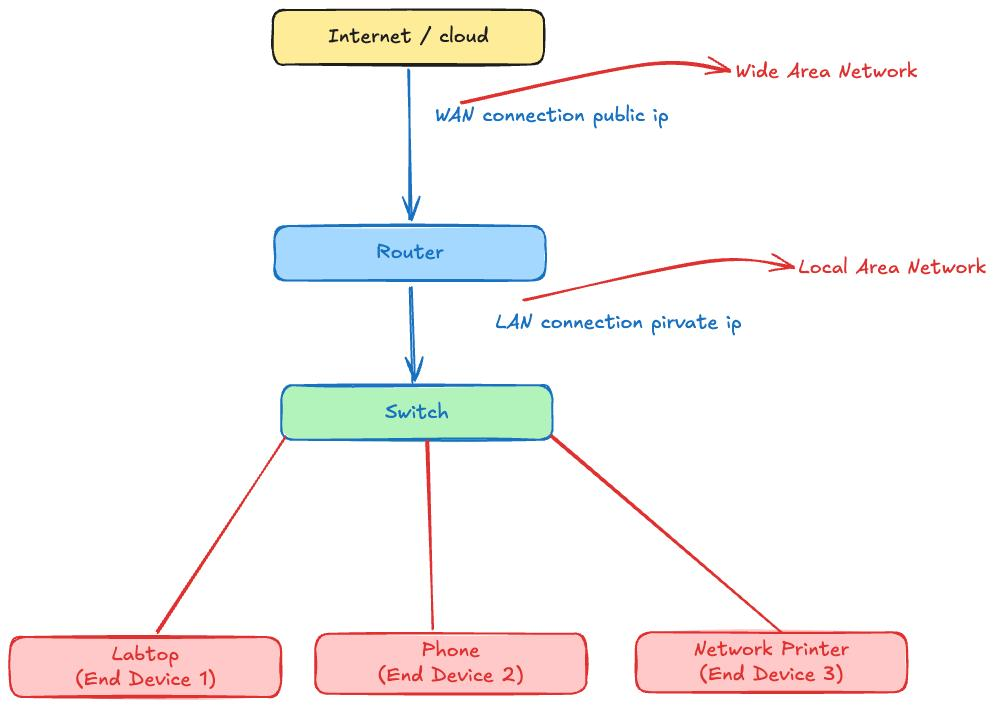

### 1. មុខងាររបស់ Layer (OSI Model)

នៅក្នុងមុខវិជ្ជា Networking ការយល់ដឹងពី OSI Model គឺចាំបាច់ណាស់។ វាមាន ៧ ស្រទាប់៖
1. Layer 7 (Application): ផ្តល់សេវាកម្មដល់អ្នកប្រើប្រាស់ផ្ទាល់ (កម្មវិធីដូចជា Web Browser)។ Protocol: HTTP, FTP, DNS។
2. Layer 6 (Presentation): បម្លែងទិន្នន័យ ចូលកូដ (Encryption) និងបង្រួមទិន្នន័យ (Compression) ឱ្យស្របតាមទម្រង់ស្តង់ដារ។
3. Layer 5 (Session): បង្កើត រក្សាទុក និងបិទការតភ្ជាប់ (Session) រវាងឧបករណ៍ពីរ។
4. Layer 4 (Transport): ធានាការបញ្ជូនទិន្នន័យពីដើមដល់ចប់ (End-to-End)។ មាន TCP (ធានាការទៅដល់) និង UDP (លឿន តែមិនធានា)។
5. Layer 3 (Network): កំណត់ផ្លូវដែលទិន្នន័យត្រូវទៅ (Routing) និងប្រើប្រាស់ Logical Address (IP Address)។ ឧបករណ៍តំណាង: Router។
6. Layer 2 (Data Link): គ្រប់គ្រងការបញ្ជូនទិន្នន័យក្នុងបណ្តាញ (Network) តែមួយ និងប្រើប្រាស់ Physical Address (MAC Address)។ ឧបករណ៍តំណាង: Switch។
7. Layer 1 (Physical): បញ្ជូនទិន្នន័យជាទម្រង់សញ្ញាអគ្គិសនី ឬពន្លឺ តាមរយៈខ្សែ។

### 2. IP Address

IP Address គឺជាអាសយដ្ឋានសម្គាល់ឧបករណ៍នីមួយៗនៅលើបណ្តាញ ដើម្បីអាចទាក់ទងគ្នាបាន។
- IPv4: មានប្រវែង 32-bit ចែកជា ៤ ផ្នែក (ឧទាហរណ៍៖ 192.168.1.10)។
- IPv6: មានប្រវែង 128-bit បង្កើតឡើងដើម្បីដោះស្រាយបញ្ហាខ្វះ IP របស់ IPv4។
- Public IP vs Private IP: Public IP ប្រើសម្រាប់ភ្ជាប់ចេញទៅ Internet ឯ Private IP (ដូចជា 192.168.x.x ឬ 10.x.x.x) ប្រើប្រាស់សម្រាប់តែបណ្តាញខាងក្នុង (LAN) ប៉ុណ្ណោះ។
- IP Classes (ចម្បងៗ): * Class A: សម្រាប់បណ្តាញធំៗ។
- Class B: សម្រាប់បណ្តាញទំហំមធ្យម។
- Class C: សម្រាប់បណ្តាញតូចៗ (ជួបញឹកញាប់ជាងគេ)។

### 3. គូស Network Diagram តូចមួយ

សម្រាប់វិញ្ញាសាប្រឡង ជាទូទៅគេតែងតែឱ្យយើងគូសបណ្តាញ LAN (Local Area Network) សាមញ្ញមួយ។ នេះជារចនាសម្ព័ន្ធដែលអ្នកគួរចងចាំ៖
1. Internet (Cloud) តភ្ជាប់មកកាន់...
2. Router (ឧបករណ៍ចេញចូល Internet និងកំណត់ផ្លូវ) តភ្ជាប់មកកាន់...
3. Switch (ឧបករណ៍បែងចែកបណ្តាញខាងក្នុង) តភ្ជាប់មកកាន់...
4. End Devices (កុំព្យូទ័រយួរដៃ PC ម៉ាស៊ីនព្រីន ឬ Server ជាដើម)។

### 4. ខ្សែ និង Connector

ការយល់ដឹងពីខ្សែដែលតភ្ជាប់ឧបករណ៍គឺសំខាន់សម្រាប់ Layer 1 នៃ OSI Model៖
- ខ្សែ Twisted Pair (UTP/STP): ជាខ្សែបណ្តាញទូទៅបំផុត (ដូចជា Cat5e, Cat6)។ វាប្រើប្រាស់ជាមួយក្បាល Connector ប្រភេទ RJ-45។
- ខ្សែ Fiber Optic: ជាខ្សែអុបទិកប្រើប្រាស់ពន្លឺសម្រាប់បញ្ជូនទិន្នន័យ មានល្បឿនលឿន និងទៅបានឆ្ងាយ។ វាប្រើប្រាស់ Connector ដូចជា SC, LC, ឬ ST។
- ខ្សែ Coaxial: ស្រដៀងនឹងខ្សែទូរទស្សន៍ (បច្ចុប្បន្នមិនសូវពេញនិយមក្នុង LAN ទេ តែអាចមានក្នុងមេរៀន)។ វាប្រើប្រាស់ក្បាល BNC។

### 5. ប្រភេទឧបករណ៍បែងចែកបណ្តាញ (Switch)

Switch គឺជាឧបករណ៍កណ្តាលសម្រាប់តភ្ជាប់ឧបករណ៍ផ្សេងៗក្នុងបណ្តាញ LAN តែមួយ។ វាដំណើរការនៅ Layer 2 ដោយស្គាល់ និងទន្ទេញ MAC Address របស់ឧបករណ៍នីមួយៗ ដើម្បីបញ្ជូនទិន្នន័យ (Frame) ទៅគោលដៅបានត្រឹមត្រូវ មិនរំខានអ្នកដទៃ។ ប្រភេទរបស់ Switch រួមមាន៖
- Unmanaged Switch: ជាប្រភេទដោតខ្សែចូលហើយដើរតែម្តង (Plug and Play) មិនអាចចូលទៅកំណត់ (Config) អ្វីបន្ថែមបានទេ។ ភាគច្រើនប្រើតាមផ្ទះ ឬការិយាល័យតូចៗ។
- Managed Switch: ជាប្រភេទដែលអាចចូលទៅកំណត់មុខងារផ្សេងៗបានយ៉ាងច្រើន (Configurable) ដូចជាការបង្កើត VLAN, កំណត់ល្បឿនទិន្នន័យ (QoS), ឬរឹតបន្តឹងសុវត្ថិភាព។ វាប្រើប្រាស់សម្រាប់ស្ថាប័ន ឬក្រុមហ៊ុនធំៗ។